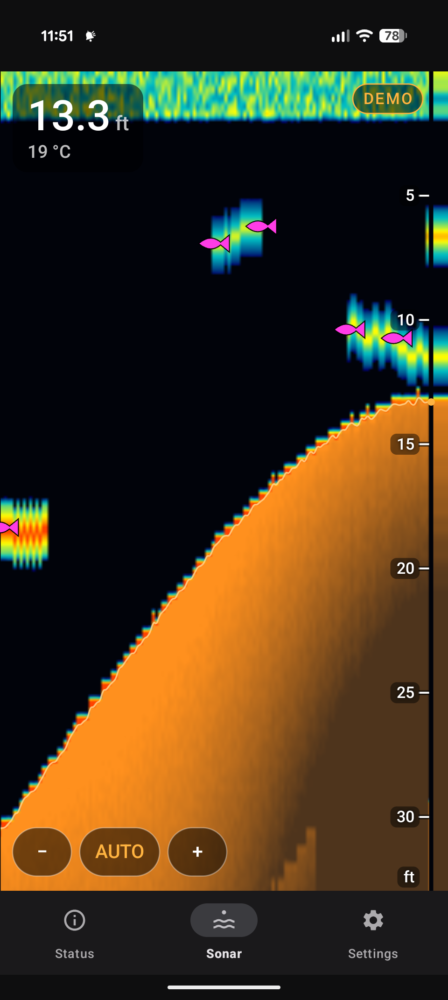
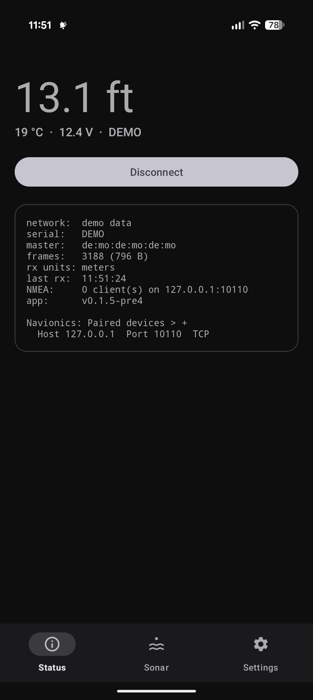
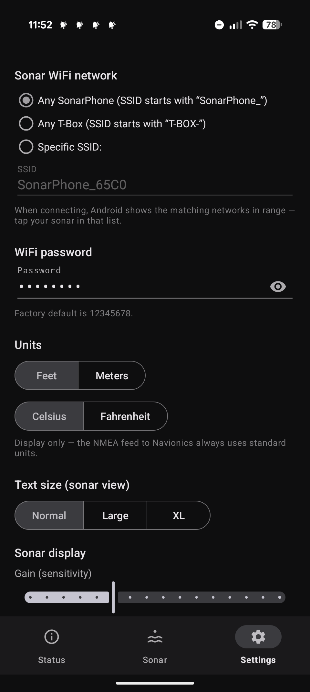

# SonarBridge

**Give your Vexilar SonarPhone SP200A a second life.**

Garmin dropped SonarPhone support from the Navionics Boating app, and Vexilar's
own app has not aged well — leaving perfectly good T-Box sonars with nowhere to
go. SonarBridge turns your Android phone into both the fish finder *and* the
missing link to Navionics: it connects directly to the SonarPhone's WiFi, shows
a modern sonar display, and feeds live depth into the Navionics app — all on
one phone, without giving up your internet connection.

  
  
  

<em>Sonar view · Status · Settings (shown in demo mode)</em>

## What it does

- **A proper fish-finder view.** Scrolling waterfall with fish echoes, a
  crisp bottom line, and bottom hardness shown the intuitive way — a dense
  blazing band over rock, a thin faint one over mud. Auto-ranging that
  doesn't jump around, manual range override, and a live A-scope strip.
- **Feeds Navionics on the same phone.** Pair the Garmin Navionics Boating
  app to `127.0.0.1` port `10110` (TCP) and it shows live depth — and can
  build SonarChart™ Live personal contour maps as you drive.
- **Keeps your internet.** The sonar's WiFi is joined as a local-only
  connection, so your phone stays on cellular for charts, weather, and
  everything else.
- **Made for the water.** Big readouts with adjustable text size, screen
  stays on while open, a shallow-water alarm, feet or meters, and it
  reconnects by itself if the sonar drops out.
- **Try it on the couch.** Demo mode generates realistic sonar data so you
  can explore the display and test the Navionics pairing with no hardware.
- **Updates itself.** The app checks GitHub for new releases and offers the
  download.

## Get it

Download the latest APK from the
[Releases page](https://github.com/RyanEwen/sonarphone-nmea-bridge/releases/latest)
and install it (you may need to allow installs from your browser).

You'll need Android 10 or newer and a SonarPhone SP200A (T-Box). Other
SonarPhone models speak the same protocol and may work, but only the SP200A
has been targeted.

## Quick start

1. Power the T-Box (it creates a WiFi network like `SonarPhone_XXXX`).
2. Open SonarBridge and tap **Connect** — pick your sonar in the network
   list Android shows.
3. Watch the Sonar tab, and/or pair Navionics: Menu → Paired devices → **+**
   → Host `127.0.0.1`, Port `10110`, TCP.

If the T-Box was factory reset, run Vexilar's official app once first so the
unit has a master device; SonarBridge rides along as a second master.

## Status

The display, networking, demo mode, and Navionics pairing are all working.
Final verification against real SP200A hardware on the water is in progress —
if something looks off with your unit, open an issue with a log.

## Developers

Protocol notes live in [sp200a-nmea-bridge-spec.md](sp200a-nmea-bridge-spec.md)
(byte-level SP200A protocol, verified against Jim McKeown's
[SP200A-Client](https://github.com/jim-mckeown/SP200A-Client) work), and the
build/deploy/release workflow is in [android/README-dev.md](android/README-dev.md).
