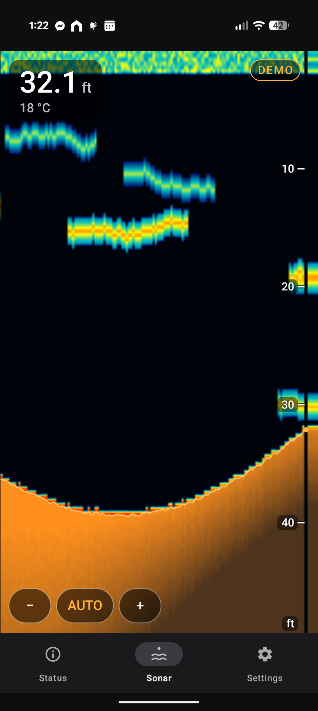
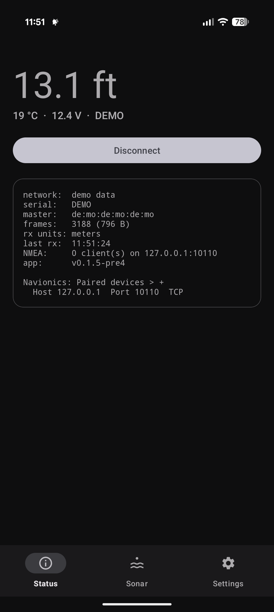
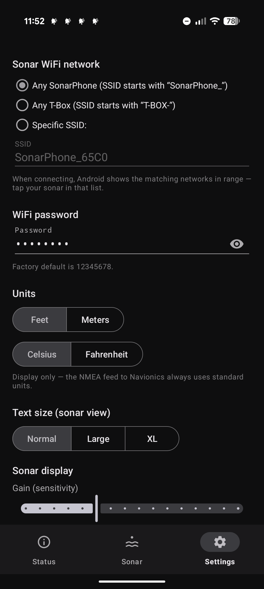
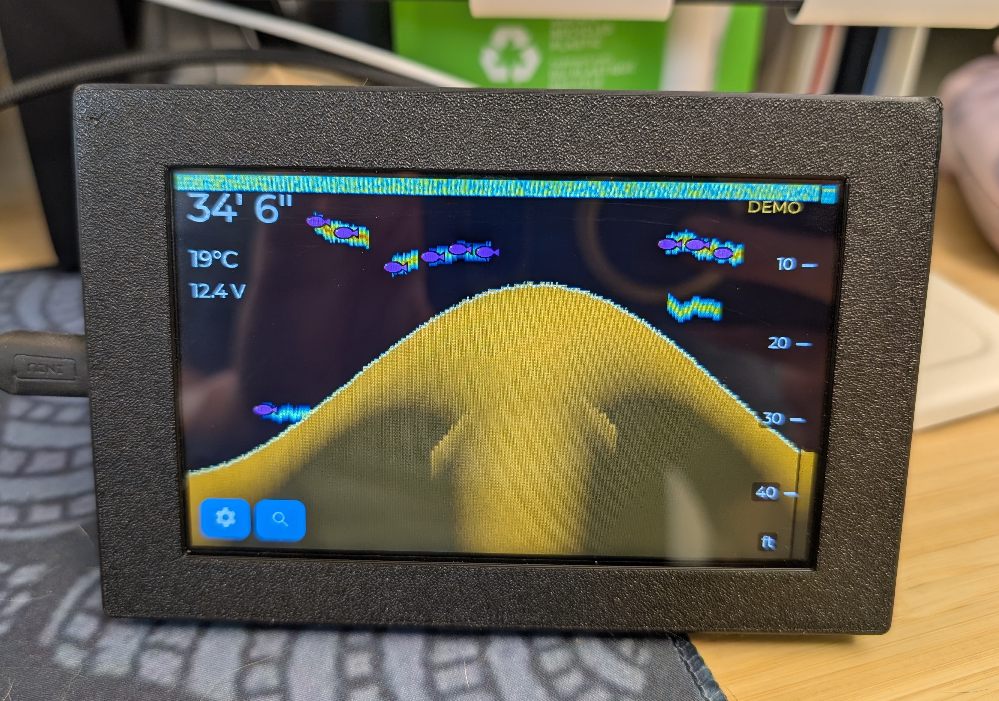

# SonarBridge

**Give your Vexilar SonarPhone SP200A a second life.**

Garmin dropped SonarPhone support from the Navionics Boating app, and Vexilar's
own app has not aged well — leaving perfectly good T-Box sonars with nowhere to
go. SonarBridge turns your Android phone into both the fish finder *and* the
missing link to Navionics: it connects directly to the SonarPhone's WiFi, shows
a modern sonar display, and feeds live depth into the Navionics app — all on
one phone, without giving up your internet connection.

  
  
  

<em>Sonar view · Status · Settings (shown in demo mode)</em>

## What it does

- **A proper fish-finder view.** Scrolling waterfall with fish echoes, a
  crisp bottom line, and bottom hardness shown the intuitive way — a dense
  blazing band over rock, a thin faint one over mud. Auto-ranging that
  doesn't jump around, manual range override, and a live A-scope strip.
- **Feeds Navionics on the same phone.** Pair the Garmin Navionics Boating
  app to `127.0.0.1` port `10110` (TCP) and it shows live depth — and can
  build SonarChart™ Live personal contour maps as you drive.
- **Keeps your internet.** The sonar's WiFi is joined as a local-only
  connection, so your phone stays on cellular for charts, weather, and
  everything else.
- **Made for the water.** Big readouts with adjustable text size, screen
  stays on while open, a shallow-water alarm, feet or meters, and it
  reconnects by itself if the sonar drops out.
- **Try it on the couch.** Demo mode generates realistic sonar data so you
  can explore the display and test the Navionics pairing with no hardware.
- **Choose your downloads.** GitHub and Google Play offer the same app.
  Install APK updates manually from GitHub, or use Google Play for updates.

## Get it

Download the APK from
[GitHub](https://github.com/RyanEwen/sonarphone-nmea-bridge/releases/tag/v0.2.5)
or install from
[Google Play](https://play.google.com/store/apps/details?id=ca.dynamicsolutions.sonarbridge)
where available. GitHub APKs named `sonarbridge-X.Y.Z-play.apk` are generated
and signed by Google Play. You do not need to use the Play Store to install
them; you may need to allow installs from your browser.

**Moving from an older GitHub APK:** first install the
[final legacy migration update (v0.2.4)](https://github.com/RyanEwen/sonarphone-nmea-bridge/releases/tag/v0.2.4)
when offered, then follow the [migration guide](docs/android-migration-release-notes.md).
The new APK cannot replace an older GitHub installation directly. Record your
settings and save any raw frame logs first, then disconnect, uninstall and
reinstall once. Re-enter settings and grant permissions afterward. Wait for a
`-play.apk` before uninstalling. Future GitHub APKs update the new app normally.

You'll need Android 10 or newer and a SonarPhone SP200A (T-Box). Other
SonarPhone models speak the same protocol and may work, but only the SP200A
has been targeted.

## Quick start

1. Power the T-Box (it creates a WiFi network like `SonarPhone_XXXX`).
2. Open SonarBridge and tap **Connect** — pick your sonar in the network
   list Android shows.
3. Watch the Sonar tab, and/or pair Navionics: Menu → Paired devices → **+**
   → Host `127.0.0.1`, Port `10110`, TCP.

If the T-Box was factory reset, run Vexilar's official app once first so the
unit has a master device; SonarBridge rides along as a second master.

## Status

**Verified working on the water with a real SP200A T-Box** (July 2026):
live depth and temperature into both the app's sonar view and Navionics,
with automatic reconnects, through a full on-water session. If something
looks off with your unit, open an issue with a log.

## Bonus: a standalone head unit

  

<em>The head unit in a 3D-printed case, running in demo mode</em>

The [`esp32-client/`](esp32-client/) folder turns a ~$20 ESP32-S3 touchscreen
(Guition/Sunton 8048S050, 5" 800×480 IPS) into a dedicated fish-finder display
for the same T-Box — no phone required on the boat at all:

- The same water-verified SP200A protocol client, ported to an ESPHome
  component
- The app's sonar rendering, ported faithfully: smoothed waterfall, fish
  markers with depth tags, bottom hardness, auto-range with hysteresis, live
  A-scope, feet-and-inches readouts
- On-screen setup: scan-and-pick your T-Box's WiFi from the settings page,
  brightness, units, palettes — all persisted on the device
- **It's also the bridge**: the unit broadcasts its own `SonarDisplay` WiFi
  network and serves NMEA on TCP `10110`, so a phone can join it and feed
  Navionics (`192.168.4.1:10110`) while the panel shows the waterfall —
  the phone keeps internet via cellular
- Tear-free double-buffered rendering via a small local fork of ESPHome's
  RGB display driver

Build, flash, and design notes live in the
[esp32-client README](esp32-client/README.md).

## Developers

Protocol notes live in [sp200a-nmea-bridge-spec.md](sp200a-nmea-bridge-spec.md)
(byte-level SP200A protocol, verified against Jim McKeown's
[SP200A-Client](https://github.com/jim-mckeown/SP200A-Client) work), and the
build/deploy/release workflow is in [android/README-dev.md](android/README-dev.md).
