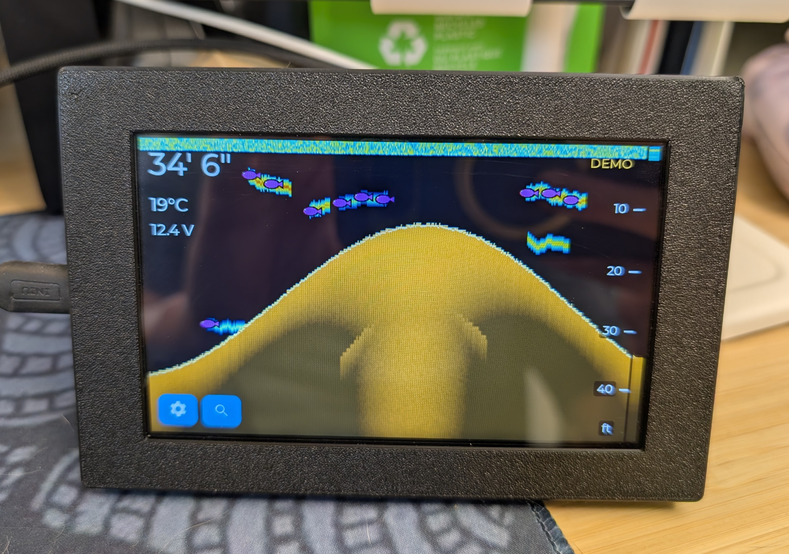

# SP200A standalone client — ESPHome (ESP32-8048S050)

<p align="center">
  
</p>

A phone-free fish finder. This turns a Guition **ESP32-8048S050** (5" 800×480
RGB IPS, GT911 touch, ESP32-S3 + octal PSRAM) into a standalone SonarPhone
display: it joins the SP200A T-Box AP directly, runs the discover/stream
handshake, and draws the echo waterfall on its own screen.

It is a **client only** — no NMEA, no Navionics, no Android. It reimplements the
sonar-facing half of the Android app (`android/…/Sp200a.kt`, the
`BridgeService` state machine, and `SonarView`) as one ESPHome external
component.

```
[SP200A T-Box AP 192.168.1.1] ──UDP:5000──► [ESP32-8048S050: sp200a component ─► LVGL canvas]
```

## Files

| Path | What |
|---|---|
| `components/sp200a/__init__.py` | ESPHome config schema + codegen (host/port/feet/beam/demo/direct_display + optional depth/temp/battery sensors) |
| `components/sp200a/sp200a.h/.cpp` | UDP client, FX/FC/REDYFC protocol, discover→run state machine, LVGL waterfall renderer, demo synth, UDP diag responder |
| `components/mipi_rgb/` | **Local fork** of ESPHome's `mipi_rgb` (from 2026.7.0): `num_fbs=2` + `get_frame_buffers()`. Enables tear-free LVGL DIRECT rendering — `sp200a`'s `direct_display:` option re-points LVGL at the panel's two framebuffers and the esp_lcd driver swaps scanout on the frame boundary instead of copying. Re-sync this fork when updating ESPHome if upstream `mipi_rgb` changes. |
| `sp200a-8048S050.yaml` | Example device config: packages the proven hardware bring-up, adds WiFi + the `sp200a:` block + the LVGL overlay UI + settings page |
| `udp-status.py` | Poll the on-device UDP status responder (`:19998`) — works even when TCP services are starved |

## Install

1. Copy `components/sp200a/` into your ESPHome config dir (next to the YAML), or
   point `external_components:` at it (a `type: local` path, or `type: git` at
   this repo's `esp32-client/components`).
2. In `sp200a-8048S050.yaml`, set `sonar_ssid` / `sonar_password` to your
   T-Box's AP (SSID prefix is `SonarPhone_`; default password `12345678`).
3. Flash over USB the first time:
   ```
   esphome run sp200a-8048S050.yaml
   ```
   (Run ESPHome in Docker per your usual setup.)

The hardware config is pulled live from
`github://RyanEwen/esphome-lvgl/devices/ESP32-8048S050.yaml`. Nothing in the
sonar code touches the display/touch/psram setup you already proved out.

## Phone AP + NMEA bridge (Navionics support)

The device doubles as the WiFi bridge the Android app provides: it runs an
always-on softAP **`SonarDisplay`** (password `12345678`) alongside its
connection to the T-Box, and serves NMEA 0183 on **TCP port 10110** on all
interfaces. A phone joins `SonarDisplay`, and Navionics pairs to
**`192.168.4.1:10110` (TCP)** — the phone keeps internet over cellular since
the OS routes only local traffic through the AP. Verified against Navionics
on Android (2026-07-18).

Live capture from the device (demo feed, over LAN):

```
$SDDPT,10.93,0.0*5C
$SDDBT,35.9,f,10.93,M,6.0,F*34
$YXMTW,18.1,C*1A
```

Same sentence set, checksums, and cadence as the Android bridge (fresh data
at ≥1 s spacing, 4 s keepalive so Navionics never clears depth, silent after
30 s of sonar staleness). Up to 4 concurrent clients; a stalled client is
dropped, never blocking the sonar loop. Configure via `sp200a:` options
`phone_ap`, `phone_ap_ssid`, `phone_ap_password` — plus a matching
`wifi: ap:` block (required: it makes ESPHome build the AP netif/DHCP glue;
the component then keeps the AP alive alongside the STA link, which ESPHome
alone treats as fallback-only).

## How it works

- **Discover:** send the constant 29-byte `FX` once/second until the T-Box
  replies `REDYFX` (serial + master MAC).
- **Run:** echo that MAC back in an `FC` request (with the additive 16-bit LE
  checksum over bytes 0–18), re-sent every 10 s. The T-Box streams ~796-byte
  `REDYFC` frames.
- Each `REDYFC` is parsed by tag + fixed offsets (depth u16le@23 +
  hundredths@25, temp °C@26, battery@30–31, units@21, 758 echo samples @38+),
  publishes the depth/temp/battery sensors, and renders one waterfall column.
- **15 s of silence → back to discover.** The MAC comes from the T-Box itself,
  so the ESP32's own WiFi MAC is irrelevant.

The renderer ports SonarView's modern palette (blue→cyan→yellow→red water,
orange-monochrome bottom), stepped **auto-range** with the same
deepen-instantly / shallow-after-dwell hysteresis, the bottom hairline, and the
one-marker-per-target fish detector. The waterfall is a full-screen `lv_canvas`
(RGB565 buffer in PSRAM) created in C++ and pushed to the background; the depth
chip, status text, and −/AUTO/+ range buttons are ordinary LVGL widgets
overlaid on top.

## Why ESPHome fits here

The protocol is pure byte math and ports near-verbatim from the Kotlin. The
whole board bring-up — the genuinely fiddly part — is already solved in your
existing config. ESPHome hands you WiFi, OTA, logging, sensors, and the LVGL
overlay UI for free; the only bespoke code is this one component.

Client-only also deletes the two hardest parts of the Android app: the
`WifiNetworkSpecifier` "keep cellular internet while on the sonar AP" dance
(the ESP32 just joins the AP as a plain STA) and the whole NMEA/Navionics
bridge half.

## Hard-learned lessons (from hardware bring-up)

These cost hours of remote debugging — do not re-learn them:

1. **Never run `lvgl.*.update` actions from `on_boot`.** They wedge the main
   loop before it starts: screen stays black, web server/API/OTA all appear
   dead while ping still answers (ICMP lives in the WiFi task). Sync widget
   state from a page `on_load` trigger instead. Plain C++ lambdas in `on_boot`
   are fine.
2. **Never do full-canvas work per incoming column.** PSRAM bandwidth is
   shared with the RGB panel's continuous DMA (~26 MB/s at 14 MHz pclk); a
   full 800×480 LVGL recomposite costs ~150 ms and one per column (~12 Hz)
   saturates the CPU. Columns are therefore *stored* at stream rate and
   *painted in batches* at 4 Hz with a single invalidate (`push_column_` /
   `render_pending_`).
3. **Scattered strided PSRAM writes are ~50× slower than row-contiguous
   ones.** The A-scope strip (20 px × 480 rows) costs ~50 ms per draw for
   this reason — it refreshes with the 4 Hz batch, never per column.
4. **Keep a UDP status responder bound from `setup()`** (port 19998, reply to
   any datagram with a one-line status). When TCP services starve, it's the
   only observation channel left, and a lazy bind fails once the loop
   degrades. Poll it with `scripts`-style stdlib python:
   `python3 udp-status.py <ip> <count> <interval>`.
5. ESPHome OTA appears to be serviced off the main loop in 2026.7 — it can
   succeed (slowly) even when everything else is wedged. Retry in a loop and
   power-cycle right before an attempt if needed.

## Known caveats / where the risk is

Status: the display stack, settings, demo mode, AP picker, and the NMEA
bridge (verified against Navionics on a phone) all run on real 8048S050
hardware. The SP200A protocol code is a line-for-line port of the Android
client that has been **verified on the water against a real T-Box** — the
one thing not yet exercised end-to-end is this device's own live connection
to a T-Box. Original bring-up caveats kept for reference:

1. **RGB panel + WiFi tearing.** The RGB peripheral streams the framebuffer out
   of PSRAM continuously; with WiFi active you may see tearing/flicker. This is
   the classic gotcha for this board class. The low 14 MHz pixel clock in your
   device file already helps. If it shows, it's a bounce-buffer / PSRAM
   bandwidth issue — the mitigation lives in the display layer, not this
   component.
2. **`reboot_timeout: 0s` is mandatory** (already set in the example). The sonar
   AP has no internet and no ESPHome API; without this the node reboots after
   ~15 min on the water.
3. **LVGL fonts.** The example uses `montserrat_20/28/36`. If ESPHome doesn't
   auto-include a size, add it under `lvgl:` → `... ` or switch to a size that's
   already bundled.
4. **Canvas creation timing.** The canvas is created lazily on the first
   `loop()` after LVGL is up (`lv_scr_act()` non-null), on the active page. It
   assumes a single-page UI; if you add page switching, re-parent or recreate
   it.
5. **Redraw cost.** One column memmove + full-canvas `lv_obj_invalidate` per
   REDYFC (~10–15 Hz). Fine on S3+PSRAM, but if the UI feels heavy, coalesce
   invalidations or shrink the canvas below full-screen.
6. **Orientation.** The device package sets `rotation: 90` (portrait, 480×800 →
   ~40 s of horizontal scrollback). For more history, use a landscape rotation
   (fork the device file or override `rotation`).

## Not ported (deliberately)

Surface-clarity fade, the 4× Catmull-Rom vertical upsample (we downsample
758→~480 instead), the A-scope strip, the classic palette, and the settings
screens. All are straightforward follow-ons once the core is proven on the
water.
